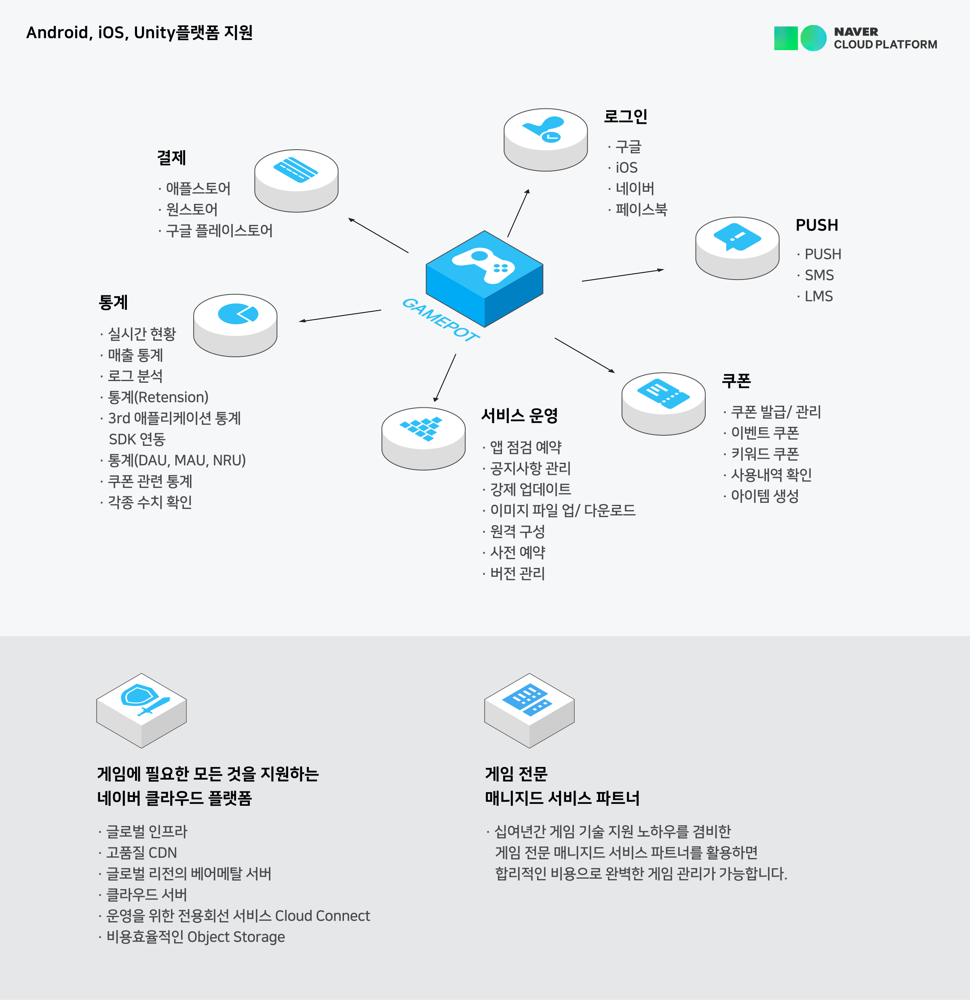

# 소개

# 게임을 위한 필수 기능을 쉽고 빠르게 구현할 수 있는 서비스

 GAMEPOT 서비스에 포함된 SDK는 기본적인 인증과 결제 뿐만 아니라 많은 개발 리소스가 필요한 다양한 통계와 모니터링, 그리고 PUSH 등과 같은 부가 기능이 포함되어 고객이 게임 컨텐츠 개발에만 집중할 수 있는 환경을 제공합니다.

## 게임팟 제품구성

### 로그인

### 결제

### 메시지

### 푸시

### 쿠폰

### 서비스 운영

### 통계

