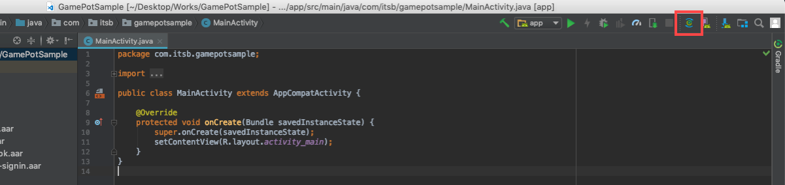
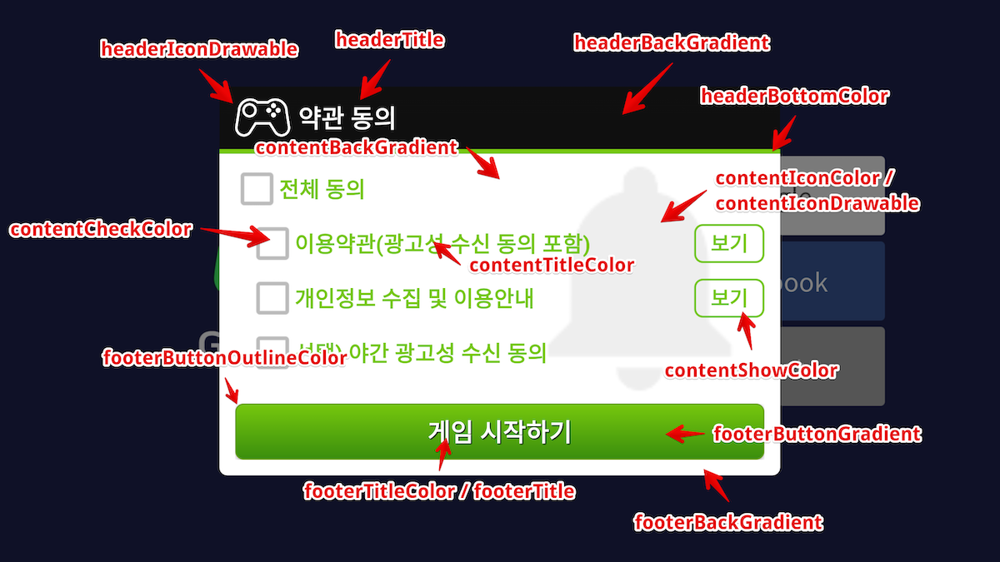

---
search:
  keyword: ['gamepot']
---

# 1. 入门

## 配置开发环境

为了开发安卓用应用程序，提前需要安装开发工具(例如Android Studio)。根据所使用的开发工具也许可能需要安装其他Java SDK和Android SDK。

在Android上使用GAMEPOT所需要的系统环境为如下。

[ 系统环境 ]

- 最低配置: API 17 (Jelly Bean, 4.2)以上, gradle 2.3.0以上
- 开发环境: Android Studio

### 创建项目


### 添加库

请把下载的AOS SDK文档添加到app/libs文件夹里。


### 设置build.gradle

build.gradle文件同时存在于项目root文件夹和app文件夹中

1. 修改项目root文件夹的build.gradle文件

   ```java
   buildscript {

       repositories {
           ...
           google()
           jcenter()
           maven { url "https://jitpack.io" }
           maven { url "https://jcenter.bintray.com" }
       }
       dependencies {
          ...
           classpath 'com.google.gms:google-services:4.2.0'
       }
   }

   allprojects {
       repositories {
           ...
           google()
           jcenter()
           maven { url "https://jitpack.io" }
           maven { url "https://jcenter.bintray.com" }
       }
   }

   ```

2. 修改app文件夹的build.gradle

   > [xxxxx]里请输入实际所使用的值。

   | 值                           | 說明                                                         |
   | ---------------------------- | ------------------------------------------------------------ |
   | gamepot_project_id           | 請輸入GAMEPOT發布的項目ID。                                  |
   | gamepot_api_url              | 請輸入GAMEPOT發布的API URL。                                 |
   | gamepot_store                | 商店價值（`google`或`one`）                                  |
   | gamepot_app_title            | 應用標題（FCM）                                              |
   | gamepot_push_default_channel | 已註冊的默認頻道名稱（默認） - 請勿更改。                    |
   | facebook_app_id              | 發給Facebook的應用程序ID                                     |
   | fb_login_protocol_scheme     | 在Facebook上發布的協議方案fb [app_id]                        |
   | gamepot_elsa_projectid       | 使用NCLOUD ELSA時的項目ID([閱讀更多](https://www.ncloud.com/product/analytics/elsa)) |

   ```java
   android {
       defaultConfig {
           ...
           // GamePot [START]
           resValue "string", "gamepot_project_id", "[projectId]" // required
           resValue "string", "gamepot_api_url", "[apiUrl]" // required
           resValue "string", "gamepot_store", "[storeId]" // required
           resValue "string", "gamepot_app_title","@string/app_name" // required (fcm)
           resValue "string", "gamepot_push_default_channel","Default" // required (fcm)
           resValue "string", "facebook_app_id", "[Facebook ID]" // facebook
           resValue "string", "fb_login_protocol_scheme", "fb[Facebook ID]" // (facebook)
           // resValue "string", "gamepot_elsa_projectid", "" // (ncp elsa)
           // GamePot [END]
       }
   }
   
   repositories {
       flatDir {
           dirs 'libs'
       }
   }
   
   dependencies {
       compile 'com.android.support:multidex:1.0.1'
   
       // GamePot common [START]
       compile(name: 'gamepot-common', ext: 'aar')
       compile('io.socket:socket.io-client:1.0.0') {
           exclude group: 'org.json', module: 'json'
       }
       compile('com.github.ihsanbal:LoggingInterceptor:3.0.0') {
           exclude group: 'org.json', module: 'json'
       }
       compile "com.github.nisrulz:easydeviceinfo:2.4.1"
       compile 'com.android.installreferrer:installreferrer:1.0'
       compile 'com.google.code.gson:gson:2.8.2'
       compile 'com.jakewharton.timber:timber:4.7.0'
       compile 'com.squareup.okhttp3:okhttp:3.10.0'
       compile 'com.apollographql.apollo:apollo-runtime:1.0.0-alpha2'
       compile 'com.apollographql.apollo:apollo-android-support:1.0.0-alpha2'
       compile 'com.android.billingclient:billing:1.1'
       compile 'com.github.bumptech.glide:glide:3.7.0'
       compile 'com.romandanylyk:pageindicatorview:1.0.0'
       compile 'com.google.firebase:firebase-core:16.0.6'
       compile 'com.google.firebase:firebase-messaging:17.3.4'
       // GamePot common [END]
   
       compile(name: 'gamepot-channel-base', ext: 'aar')
       // GamePot facebook [START]
       compile(name: 'gamepot-channel-facebook', ext: 'aar')
       compile 'com.facebook.android:facebook-android-sdk:5.2.0'
       // GamePot facebook [END]
   
       // GamePot google sigin [START]
       compile(name: 'gamepot-channel-google-signin', ext: 'aar')
       compile "com.google.android.gms:play-services-base:16.0.1"
       compile "com.google.android.gms:play-services-auth:16.0.1"
       // GamePot google sigin [END]
   }
   
   // ADD THIS AT THE BOTTOM
   apply plugin: 'com.google.gms.google-services'
   ```

3. 将从Google下载的google-service.json文件复制到/app/文件夹里。

4. Gradle Sync Now

   在Android Studio中，点击下面的按钮进行刷新。



* 刷新之后也许可能发生的错误为如下

  * Configuration 'compile' is obsolete and has been replaced with 'implementation' and 'api'.
    It will be removed at the end of 2018. For more information see: <http://d.android.com/r/tools/update-dependency-configurations.html>

    > 如果使用的Gradle版本是3以上的版本的时候， 请把compile implementation

  * No matching client found for package name 'packagename'

    > 请统一更改app的包名和google-service.json里所使用的包名。

### 设置AndroidManifest.xml

添加通常在游戏所使用的设置值。每个设置的详细说明请参阅代码。

> 推荐事项。请由开发公司来判断是否要使用推荐事项。

```xml
<?xml version="1.0" encoding="utf-8"?>
<manifest xmlns:android="http://schemas.android.com/apk/res/android"
    xmlns:tools="http://schemas.android.com/tools">

    <!--设置为无电话功能的设备上也可以从渠道下载应用-->
    <uses-feature android:name="android.hardware.telephony" android:required="false" />
    <!--设置为具有语音聊天的游戏，让没有麦克风的设备也可以从渠道下载应用-->
    <uses-feature android:name="android.hardware.microphone" android:required="false" />

    <!--allowBackup务必要设置为false。(为了防止重新安装游戏的时候自动恢复shared preference值。)-->
    <application
        android:name="android.support.multidex.MultiDexApplication"
        android:allowBackup="false"
        tools:replace="android:allowBackup">

        <!--resizeableActivity : 禁止使用应用拆分画面屏幕-->
        <activity
            android:resizeableActivity="false">
            <intent-filter>
                <action android:name="android.intent.action.MAIN" />
                <category android:name="android.intent.category.LAUNCHER" />
            </intent-filter>
        </activity>

        <!--支持Galaxy S8的屏幕-->
        <meta-data android:name="android.max_aspect" android:value="2.1" />

    </application>
</manifest>
```

### 设置Push Notification图标


收到推送时在Notification bar所显示的icon基本使用SDK内部的默认图片，也可以依照游戏来加入适合游戏的图标。

#### 添加icon

> [Android Asset Studio](http://romannurik.github.io/AndroidAssetStudio/icons-notification.html#source.type=clipart&source.clipart=ac_unit&source.space.trim=1&source.space.pad=0&name=ic_stat_gamepot_small)制作图标时会自动创建每个文件夹的图标，就把这些放入对应的文件夹即可。

1. 创建res/drawable相关文件夹，如下。
   - res/drawable-mdpi/
   - res/drawable-hdpi/
   - res/drawable-xhdpi/
   - res/drawable-xxhdpi/
   - res/drawable-xxxhdpi/

2. 制作每个尺寸的图像，如下。
    - 24x24
    - 36x36
    - 48x48
    - 72x72
    - 96x96

3. 对每个文件夹添加对应尺寸的图像，如下。

|  文件夹名                |  尺寸  |
|  --------------------   |  -----  |
|  res/drawable-mdpi/     |  24x24  |
|  res/drawable-hdpi/     |  36x36  |
|  res/drawable-xhdpi/    |  48x48  |
|  res/drawable-xxhdpi/   |  72x72  |
|  res/drawable-xxxhdpi/  |  96x96  |

4. 将图像文件名更改为`ic_stat_gamepot_small`

**危險的權限**

GAMEPOT不包括[危險許可](https://developer.android.com/guide/topics/permissions/overview)，但如果您使用下面的庫，則可能會添加它。

| 圖書館名稱     | 指南                                                     |
| -------------- | -------------------------------------------------------- |
| Naver Cafe SDK | [鏈接](https://github.com/naver/cafe-sdk-android#usages) |

# 2. 初始化

在MainActivity.java文件里添加下面内容。

```java
import io.gamepot.common.GamePot;
import io.gamepot.common.GamePotLocale;

@Override
protected void onCreate(Bundle savedInstanceState) {
    super.onCreate(savedInstanceState);
    // 初始化GAMEPOT。context必须要放入application context。
    // setup API需要比其他API首先调用才可以。
    GamePot.getInstance().setup(getApplicationContext());
}

@Override
protected void onActivityResult(int requestCode, int resultCode, Intent data) {
    super.onActivityResult(requestCode, resultCode, data);
    GamePot.getInstance().onActivityResult(requestCode, resultCode, data);
}

@Override
protected void onStart() {
    super.onStart();
    GamePotChat.getInstance().start();
}

@Override
protected void onStop() {
    super.onStop();
    GamePotChat.getInstance().stop();
}

@Override
protected void onDestroy() {
    super.onDestroy();
    GamePot.getInstance().onDestroy();
}
```

# 3. 登录，退出，注销

可以集成使用各种登录SDK。如Google，FaceBook，Naver等。

## 设置Google(Firebase) Console

编译APK时所使用的Keystore的SHA-1值添加到Firebase console。

> 请求开发公司提供SHA-1值。


## 设置FaceBook Console

编译APK时所使用的Keystore的key hash值添加到FaceBook Console上。

> 请求开发公司提供Key hash值。


## 设置

### 修改MainActivity.java文件

声明登录相关代码，如下。

```java
import io.gamepot.channel.GamePotChannel;
import io.gamepot.channel.GamePotChannelType;
import io.gamepot.channel.facebook.GamePotFacebook;
import io.gamepot.channel.google.signin.GamePotGoogleSignin;

public class MainActivity extends AppCompatActivity {
    @Override
    protected void onCreate(Bundle savedInstanceState) {
        // setup API需要首先调用。
        GamePot.getInstance().setup(getApplicationContext());

        ...
        // 所要使用登录的每个频道请调用addChannel。(Guest方式默认包含)
        // 初始化Google Login
        GamePotChannel.getInstance().addChannel(this, GamePotChannelType.GOOGLE, new GamePotGoogleSignin());
        // 初始化Facebook Login
        GamePotChannel.getInstance().addChannel(this, GamePotChannelType.FACEBOOK, new GamePotFacebook());
        ...
    }

    @Override
    protected void onActivityResult(int requestCode, int resultCode, Intent data) {
        super.onActivityResult(requestCode, resultCode, data);
        GamePotChannel.getInstance().onActivityResult(this, requestCode, resultCode, data);
    }

    @Override
    protected void onDestroy() {
        super.onDestroy();
        GamePotChannel.getInstance().onDestroy();
    }
}
```

## 登录

登录UI需要由开发公司来支持实现，将点击登录按钮时调用登录相关代码。

```java
import io.gamepot.channel.GamePotChannel;
import io.gamepot.channel.GamePotChannelListener;
import io.gamepot.channel.GamePotChannelType;
import io.gamepot.channel.GamePotUserInfo;
import io.gamepot.common.GamePotError;

// 定义登录类型
// GamePotChannelType.GOOGLE: Google
// GamePotChannelType.FACEBOOK: FaceBook
// GamePotChannelType.NAVER: Naver
// GamePotChannelType.LINE: LINE
// GamePotChannelType.TWITTER: Twitter
// GamePotChannelType.GUEST: 游客

// 点击Google登录按钮的时候调用
GamePotChannel.getInstance().login(this, GamePotChannelType.GOOGLE, new GamePotChannelListener<GamePotUserInfo>() {
    @Override
    public void onCancel() {
        // 用户取消登录
    }

    @Override
    public void onSuccess(GamePotUserInfo userinfo) {
        // 登录成功。依照游戏逻辑处理。
        // userinfo.getMemberid() : 会员唯一ID
    }

    @Override
    public void onFailure(GamePotError error) {
        // 登录失败。请使用error.getMessage()来显示错误信息。
    }
});
```

### 会员唯一ID

```java
GamePot.getInstance().getMemberId();
```

## 自动登录

可以使用传达用户最终登录信息的API实现自动登录。

```java
import io.gamepot.channel.GamePotChannel;
import io.gamepot.channel.GamePotChannelListener;
import io.gamepot.channel.GamePotChannelType;
import io.gamepot.channel.GamePotUserInfo;
import io.gamepot.common.GamePotError;

// 传达用户最终登录信息的API
final GamePotChannelType lastLoginType = GamePotChannel.getInstance().getLastLoginType();

if(lastLoginType != GamePotChannelType.NONE) {
    // 使用最终登录的登录类型来登录的方式。
    GamePotChannel.getInstance().login(this, lastLoginType, new GamePotChannelListener<GamePotUserInfo>() {
        @Override
        public void onCancel() {
            // 用户取消登录。
        }

        @Override
        public void onSuccess(GamePotUserInfo info) {
            // 自动登录成功。依照游戏逻辑处理。
        }

        @Override
        public void onFailure(GamePotError error) {
            // 自动登录失败。请使用error.getMessage()来显示错误信息。
        }
    });
}
else
{
    // 首次启动游戏或者退出状态。请移动至可以登录的登录界面。
}
```

## 退出

退出目前会员账号。

```java
import io.gamepot.channel.GamePotChannel;
import io.gamepot.common.GamePotCommonListener;
import io.gamepot.common.GamePotError;

GamePotChannel.getInstance().logout(this, new GamePotCommonListener() {
    @Override
    public void onSuccess() {
        // 退出成功。请移动至初始界面。
    }

    @Override
    public void onFailure(GamePotError error) {
        // 退出失败。请使用error.getMessage()来显示错误信息。
    }
});
```

## 账户注销

注销目前的会员账户。

```java
import io.gamepot.channel.GamePotChannel;
import io.gamepot.common.GamePotCommonListener;
import io.gamepot.common.GamePotError;

GamePotChannel.getInstance().deleteMember(this, new GamePotCommonListener() {
    @Override
    public void onSuccess() {
        // 注销成功。请移动至初始界面。
    }

    @Override
    public void onFailure(GamePotError error) {
        // 注销失败。请使用error.getMessage()来显示错误信息。
    }
});
```

# 4. 绑定账户

可以将多个社交账户(Google，FaceBook 等)连接/断开连接到一个游戏账户的功能。(至少可以绑定一个社交账户。)

> 绑定相关UI界面，请由开发公司来支持实现。

## 绑定账户

可以使用Google, Facebook 等账号来绑定账户。

```java
import io.gamepot.channel.GamePotChannel;
import io.gamepot.channel.GamePotChannelListener;
import io.gamepot.channel.GamePotChannelType;
import io.gamepot.channel.GamePotUserInfo;
import io.gamepot.common.GamePotError;

// 绑定到Google账户
// GamePotChannelType.GOOGLE
// 绑定到FaceBook账户
// GamePotChannelType.FACEBOOK
// 绑定到Naver账户
// GamePotChannelType.NAVER
// 绑定到LINE账户
// GamePotChannelType.LINE
// 绑定到Twitter账户
// GamePotChannelType.TWITTER

GamePotChannel.getInstance().createLinking(this, GamePotChannelType.GOOGLE, new GamePotChannelListener<GamePotUserInfo>() {
    @Override
    public void onSuccess(GamePotUserInfo userInfo) {
        // 绑定成功。请把绑定结果的文本提示给用户。(如：계정 연동에 성공했습니다. （绑定成功）)
    }

    @Override
    public void onCancel() {
        // 用户取消
    }

    @Override
    public void onFailure(GamePotError error) {
        // 绑定失败。请使用error.getMessage()来显示错误信息。
    }
});
```

## 绑定列表

可以通过此API检查账户的绑定状态。

```java
import io.gamepot.channel.GamePotChannel;
import java.util.ArrayList;

// 定义类型
// GamePotChannelType.GOOGLE
// GamePotChannelType.FACEBOOK
// GamePotChannelType.NAVER
// GamePotChannelType.LINE
// GamePotChannelType.TWITTER
// 依照类型返回绑定结果。
boolean isLinked = GamePotChannel.getInstance().isLinked(GamePotChannelType.GOOGLE);

// 对目前绑定的所有类型以JSON形式返回。
// 如果同时绑定在GOOGLE和FACEBOOK的情况下，返回为如下。
// [{“provider”:”google”},{“provider”:”facebook”}]
JSONArray linking = GamePotChannel.getInstance().getLinkedList();
```


## 解除绑定

解除已绑定的账户。

```java
import io.gamepot.channel.GamePotChannel;
import io.gamepot.channel.GamePotChannelType;
import io.gamepot.common.GamePotCommonListener;
import io.gamepot.common.GamePotError;

GamePotChannel.getInstance().deleteLinking(this, GamePotChannelType.GOOGLE, new GamePotCommonListener() {
    @Override
    public void onSuccess() {
        // 解除绑定成功。请把绑定结果的文本提示给用户。(如：계정 연동을 해지했습니다. （解除绑定成功）)
    }

    @Override
    public void onFailure(GamePotError error) {
        // 解除绑定失败。请使用error.getMessage()来显示错误信息。
    }
});
```

# 5. 支付

支付的结果值以Listener形式来实现。

声明MainActivity.java在执行运行应用程序时调用一次。

```java
import io.gamepot.common.GamePot;
import io.gamepot.common.GamePotPurchaseInfo;
import io.gamepot.common.GamePotPurchaseListener;
import io.gamepot.common.GamePotError;

public class MainActivity extends AppCompatActivity {
    @Override
    protected void onCreate(Bundle savedInstanceState) {
        // setup API需要首先被调用。
        GamePot.getInstance().setup(getApplicationContext());

        ...
		GamePot.getInstance().setPurchaseListener(new GamePotPurchaseListener<GamePotPurchaseInfo>() {
            @Override
            public void onSuccess(GamePotPurchaseInfo info) {
                // 支付成功。物品发放请求会对webhook所设置的地址上，以server to server请求。
                // 请在此地方只处理结果，并不要发放实际物品。
            }

            @Override
            public void onFailure(GamePotError error) {
                // 支付失败。请使用error.getMessage()来显示错误信息。
            }

            @Override
            public void onCancel() {
                // 用户取消支付。
            }
        });
        ...
    }
}
```

## 尝试支付

可以使用一个支付API来支付GooglePlay, OneStore

> 请确保您在付款尝试〜付款完成/失败过程中浮动游戏中使用的加载屏幕，以确保您不会进行重复呼叫。

```java
import io.gamepot.common.GamePot;

// productId请输入每个渠道所注册的产品ID。
GamePot.getInstance().purchase("product id");
```

##獲取付款項目清單

您可以獲取商店提供的應用內商品列表。

```java
import io.gamepot.common.GamePot;

GamePotPurchaseDetailList details = GamePot.getInstance（）。GetPurchaseDetailList（）;
```

##付款項目付款

GAMEPOT無法非法支付，因為它通過服務器到服務器api完成對支付商店收據的驗證後向開發者服務器發出支付請求。

要執行此操作，請參閱“服務器”中的“購買”項目到服務器api菜單。

#6. 外部付款

一個商店接受第三個支付模塊而不是基本商店支付模塊。

##設置

請先參閱信息中心上的外部結算項目，先設置信息中心。

5.如果您先實施了“付款”項目，則沒有其他設置。

##付款嘗試

```java
import io.gamepot.common.GamePot;

//活動：當前活動
//產品ID：您在信息中心上註冊的付款ID
GamePot.getInstance().PurchaseThirdPayments(活動,產品ID);
```

##獲取付款項目清單

```java
import io.gamepot.common.GamePot;

GamePotPurchaseDetailList thirdPaymentsDetailList = GamePot.getInstance().getPurchaseThirdPaymentsDetailList();
```

# 7. 其他API

##Naver登錄

### build.gradle設置

```java
android {
    defaultConfig {
        ...
        resValue "string", "gamepot_naver_clientid", "xxxxxxxx"//從Naver Developer Console獲得
        resValue "string", "gamepot_naver_secretid", "xxx" // 從Naver開發者控制台獲取
    }
}

dependencies {
  ...
  compile(name: 'gamepot-channel-naver', ext: 'aar')
  ...
}
```

### MainActivity.java 設置

```java
import io.gamepot.channel.GamePotChannel;
import io.gamepot.channel.GamePotChannelType;
import io.gamepot.channel.naver.GamePotNaver;

@Override
protected void onCreate(Bundle savedInstanceState) {
    super.onCreate(savedInstanceState);
		...
		GamePotChannel.getInstance().addChannel(this, GamePotChannelType.NAVER, new GamePotNaver());
}
```

### 登錄

```java
GamePotChannel.getInstance().login(this, GamePotChannelType.NAVER, new GamePotAppStatusChannelListener<GamePotUserInfo>() {
  ...
});
```

##LINE登錄

### build.gradle設置

```java
android {
    defaultConfig {
        ...
        resValue "string", "gamepot_line_channelid","00000000" // 從Line Developer Console獲取
    }
}

dependencies {
  ...
  compile(name: 'gamepot-channel-line', ext: 'aar')
  compile(name: 'line-sdk-4.0.10', ext: 'aar')
  ...
}
```

### MainActivity.java設置

```java
import io.gamepot.channel.GamePotChannel;
import io.gamepot.channel.GamePotChannelType;
import io.gamepot.channel.line.GamePotLine;

@Override
protected void onCreate(Bundle savedInstanceState) {
    super.onCreate(savedInstanceState);
		...
		GamePotChannel.getInstance().addChannel(this, GamePotChannelType.LINE, new GamePotLine());
}
```

### 登錄

```java
GamePotChannel.getInstance().login(this, GamePotChannelType.LINE, new GamePotAppStatusChannelListener<GamePotUserInfo>() {
  ...
});
```

## Twitter登錄

### build.gradle設置

```java
android {
    compileOptions {
        sourceCompatibility JavaVersion.VERSION_1_8
        targetCompatibility JavaVersion.VERSION_1_8
    }
  
    defaultConfig {
        ...
        resValue "string", "gamepot_twitter_consumerkey","xxxxx" //從Twitter開發者控制台獲取
        resValue "string", "gamepot_twitter_consumersecret","xxx" //從Twitter開發者控制台獲取
    }
}

dependencies {
  ...
  compile(name: 'gamepot-channel-twitter', ext: 'aar')
  compile('com.twitter.sdk.android:twitter-core:3.3.0@aar') {
      transitive = true
  }
  ...
}
```

### MainActivity.java設置

```java
import io.gamepot.channel.GamePotChannel;
import io.gamepot.channel.GamePotChannelType;
import io.gamepot.channel.twitter.GamePotTwitter;

@Override
protected void onCreate(Bundle savedInstanceState) {
    super.onCreate(savedInstanceState);
		...
		GamePotChannel.getInstance().addChannel(this, GamePotChannelType.TWITTER, new GamePotTwitter());
}
```

### 登錄

```java
GamePotChannel.getInstance().login(this, GamePotChannelType.TWITTER, new GamePotAppStatusChannelListener<GamePotUserInfo>() {
  ...
});
```

## 优惠卷

使用用户输入的优惠卷时调用下面代码。

> 输入优惠卷的UI界面，请由开发公司支持实现。

```java
import io.gamepot.common.GamePot;
import io.gamepot.common.GamePotError;
import io.gamepot.common.GamePotListener;

GamePot.getInstance().coupon(/*用户所输入的优惠卷*/, new GamePotListener<String>() {
    @Override
    public void onSuccess(String message) {
        // 优惠卷使用成功。message值请以弹窗来显示给用户。
    }

    @Override
    public void onFailure(GamePotError error) {
        // 优惠卷使用失败。请使用error.getMessage()来显示错误信息。
    }
});
```

###項目付款

如果成功使用優惠券，則要求開發者服務器通過服務器向服務器api支付該項目。

要執行此操作，請參閱`服務器到服務器api`菜單中的`項目`項。

## Push on/off

全体推送，夜间推送和广告推送的这3种类型的推送可以各个设置开关。

> 设置开关on/off的UI界面，请由开发公司来支持实现。

```java
import io.gamepot.common.GamePot;
import io.gamepot.common.GamePotError;
import io.gamepot.common.GamePotCommonListener;

// 接受推送 On/Off
GamePot.getInstance().setPushEnable(/*true or false*/, new GamePotCommonListener() {
    @Override
    public void onSuccess() {
    }

    @Override
    public void onFailure(GamePotError error) {
    }
});

// 接受夜间推送 On/Off
GamePot.getInstance().setNightPushEnable(/*true or false*/, new GamePotCommonListener() {
    @Override
    public void onSuccess() {
    }

    @Override
    public void onFailure(GamePotError error) {
    }
});

// 一并设置推送，夜间推送，广告推送
// 游戏如果在登录之前接受推送，夜间推送，广告推送时，必须要在登录之后调用以下代码。
GamePot.getInstance().setPushEnable(/*true or false*/, /*true or false*/, true, new GamePotCommonListener() {
    @Override
    public void onSuccess() {
    }

    @Override
    public void onFailure(GamePotError error) {
    }
});
```

如要获得目前推送状态时，请参阅以下代码。

```java
import io.gamepot.common.GamePot;
import org.json.JSONObject;

// enable: 全体推送
// night: 夜间推送
// {"enable":true, "night":true}
JSONObject status = GamePot.getInstance().getPushStatus();
```

## 公告

DashBoard - 在公告栏所上传图像显示的功能。

### 调用

```java
GamePot.getInstance().showNotice(/*當前活動*/, new GamePotNoticeDialog.onSchemeListener() {
    @Override
    public void onReceive(String scheme) {
        // TODO : 方案處理
    }
});
```

## 客户中心

DashBoard - 连接客户中心的功能。用户与运营商之间的沟通窗口。

### 调用

```java
GamePot.getInstance().showCSWebView(/*目前Activity*/);
```

## 本地推送(Local Push notification)

不通过推送服务器，直接在设备自行推送的功能。

### 调用

#### 推送注册

在指定时间显示本地推送的方法为如下。

> 返回所传达的pushid值由开发公司来管理。

```java
String date = "2018-09-27 20:00:00";
GamePotLocalPushBuilder builder = new GamePotLocalPushBuilder(getActivity())
                        .setTitle("로컬푸시 테스트（本地推送测试）")
                        .setMessage("로컬푸시 메시지입니다.（本地推送信息） " + date)
                        .setDateString(date).build();
int pushid = GamePot.getInstance().sendLocalPush(builder);
```

#### 取消注册推送

可以根据注册推送时所获得的pushid来取消现有的推送。

```java
GamePot.getInstance().cancelLocalPush(/*目前Activity*/, /*注册推送时获得的pushid*/);
```

## 维护，强制更行

需要维护或者强制更新功能的时候， DashBoard - 运营中操作激活功能就可以使用。

### 调用

在现有的下面API里可以使用。

#### 1. login API

在现有login API里，把listener更改为`GamePotAppStatusChannelListener`。

```java
GamePotChannel.getInstance().login(this, GamePotChannelType.GOOGLE, new GamePotAppStatusChannelListener<GamePotUserInfo>() {
    @Override
    public void onNeedUpdate(GamePotAppStatus status) {
        // TODO : 需要强制更新的时候。 调用下面API就可以弹出SDK本身的弹出窗口。
        // TODO : 如希望Customizing的时候，请不要调用下面API并对其进行Customizing就可以。
        GamePot.getInstance().showAppStatusPopup(MainActivity.this, status, new GamePotAppCloseListener() {
            @Override
            public void onClose() {
                // TODO : 如调用showAppStatusPopup API，会在结束应用程序的情况下被调用。
                // TODO : 处理关闭过程。
                MainActivity.this.finish();
            }

            @Override
            public void onNext（Object obj）{
                // TODO：“仪表板更新设置”中的“推荐”设置显示“下一步”按钮。
                //当用户选择它时，将调用此按钮。
                // TODO：请使用obj信息处理与登录完成相同的信息。
                // GamePotUserInfo userInfo =（GamePotUserInfo）obj;
            }
        });
    }

    @Override
    public void onMainternance(GamePotAppStatus status) {
        // TODO : 如在维护中。调用下面API就可以弹出SDK本身的弹出窗口。
        // TODO : 如希望Customizing的时候，请不要调用下面API并对其进行Customizing就可以。
        GamePot.getInstance().showAppStatusPopup(MainActivity.this, status, new GamePotAppCloseListener() {
            @Override
            public void onClose() {
                // TODO : 如调用showAppStatusPopup API，会在结束应用程序的情况下被调用。
                // TODO : 处理关闭过程。
                MainActivity.this.finish();
            }
        });
    }

    @Override
    public void onCancel() {
        // 用户取消登录。
    }

    @Override
    public void onSuccess(GamePotUserInfo userinfo) {
        // 登录成功。依照游戏逻辑处理。
    }

    @Override
    public void onFailure(GamePotError error) {
        // 登录失败。请使用error.getMessage()来显示错误信息。
    }
});
```

## 接受条款

我们提供用户界面，以便轻松获取“使用条款”和“收集和使用个人信息指南”。

`BLUE`主题和`GREEN`主题，每个区域都有自定义。

- `BLUE`主题的例子

  

- `GREEN`主题的例子

  

### 征集协议

> 请同意协议弹出窗口的条款由开发人员处理。
>
> 可以在仪表板中应用和修改“查看”按钮的内容。

Request:

```csharp
// 基本调用（应用为BLUE主题）
GamePot.getInstance().showAgreeDialog(/*activity*/, new GamePotAgreeBuilder(), new GamePotListener<GamePotAgreeInfo>() {
    @Override
    public void onSuccess(GamePotAgreeInfo data) {
    	// info.agree : 如果所有必需条件都为真，则为真
  	  // info.agreeNight : 如果检查晚间广告接受，则为真; 否则是假的
	    // 登录后，通过setPushNightStatus api传递agreeNight值。
    }

    @Override
    public void onFailure(GamePotError error) {
			// error.message请使用弹窗告知给用户
    }
});

// 应用为“绿色”主题
GamePotAgreeBuilder bulider = new GamePotAgreeBuilder(GamePotAgreeBuilder.THEME.GREEN);
GamePot.getInstance().showAgreeDialog(/*activity*/, bulider, new GamePotListener<GamePotAgreeInfo>() {
  ....
}
```

### 定制

在不使用主题的情况下更改游戏的颜色。

在调用协议之前，您可以在“GamePotAgreeBuilder”中为每个区域指定颜色。

```c#
GamePotAgreeBuilder agreeBuilder= new GamePotAgreeBuilder();
agreeBuilder.setHeaderBackGradient(new int[] {0xFF00050B,0xFF0F1B21});
agreeBuilder.setHeaderTitleColor(0xFFFF0000);
agreeBuilder.setHeaderBottomColor(0xFF00FF00);
// 不使用时设为“”
agreeBuilder.setHeaderTitle("약관 동의");
// res/drawable 对象ID（文件名）
agreeBuilder.setHeaderIconDrawable(R.drawable.ic_stat_gamepot_agree);

agreeBuilder.setContentBackGradient(new int[] { 0xFFFF2432, 0xFF11FF32 });
agreeBuilder.setContentTitleColor(0xFF0429FF);
agreeBuilder.setContentCheckColor(0xFFFFADB5);
agreeBuilder.setContentIconColor(0xFF98FFC6);
agreeBuilder.setContentShowColor(0xFF98B3FF);
// res/drawable 对象ID（文件名）
agreeBuilder.setContentIconDrawable(R.drawable.ic_stat_gamepot_small);

agreeBuilder.setFooterBackGradient(new int[] { 0xFFFFFFFF, 0xFF112432 });
agreeBuilder.setFooterButtonGradient(new int[] { 0xFF1E3A57, 0xFFFFFFFF });
agreeBuilder.setFooterButtonOutlineColor(0xFFFF171A);
agreeBuilder.setFooterTitleColor(0xFFFF00D5);
agreeBuilder.setFooterTitle("게임 시작하기");
// 夜间广告接受按钮曝光
agreeBuilder.setShowNightPush(true);

// 更改文字
agreeBuilder.setAllMessage("모두 동의");
agreeBuilder.setTermMessage("필수) 이용약관");
agreeBuilder.setPrivacyMessage("필수) 개인정보 취급 방침");
agreeBuilder.setNightPushMessage("선택) 야간 푸시 수신 동의");

GamePot.getInstance().showAgreeDialog(/*activity*/, agreeBuilder, new GamePotListener<GamePotAgreeInfo>() {
  ....
}
```

每个变量都应用于下面的区域。

> contentIconDrawable仅在AOS上显示，默认值设置为推送图标。



## 服务条款

调用使用条款UI。

> 儀表板 - 客戶支持 - 首先在條款和條件部分輸入您的內容。

```java
import io.gamepot.common.GamePot;

// activity : 當前Activity
GamePot.getInstance().showTerms(activity);
```


## 隐私声明

调用隐私策略UI。

> 儀表板 - 客戶支持 - 首先輸入您的隱私策略設置。

```java
import io.gamepot.common.GamePot;

// activity : 當前Activity
GamePot.getInstance().showPrivacy(activity);
```


