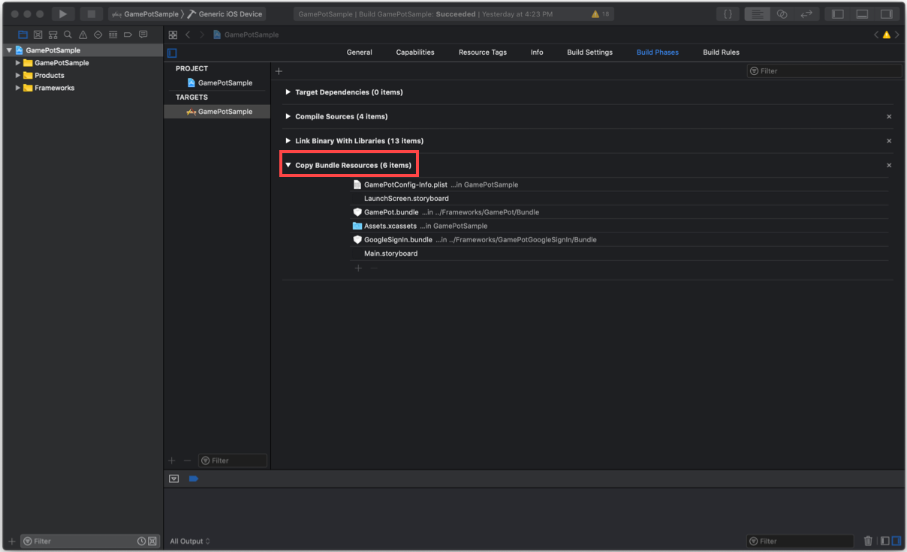
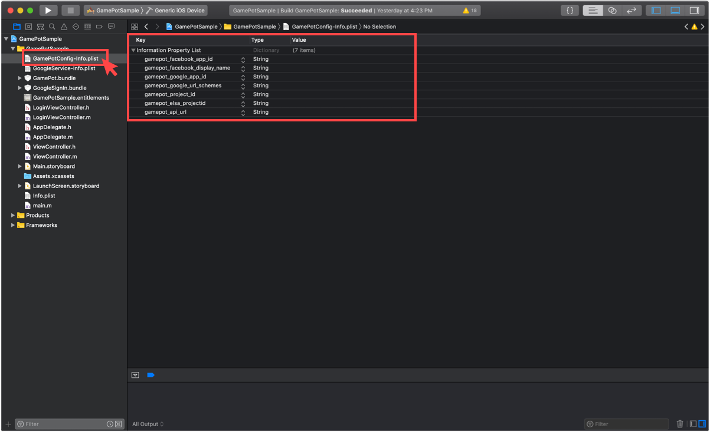
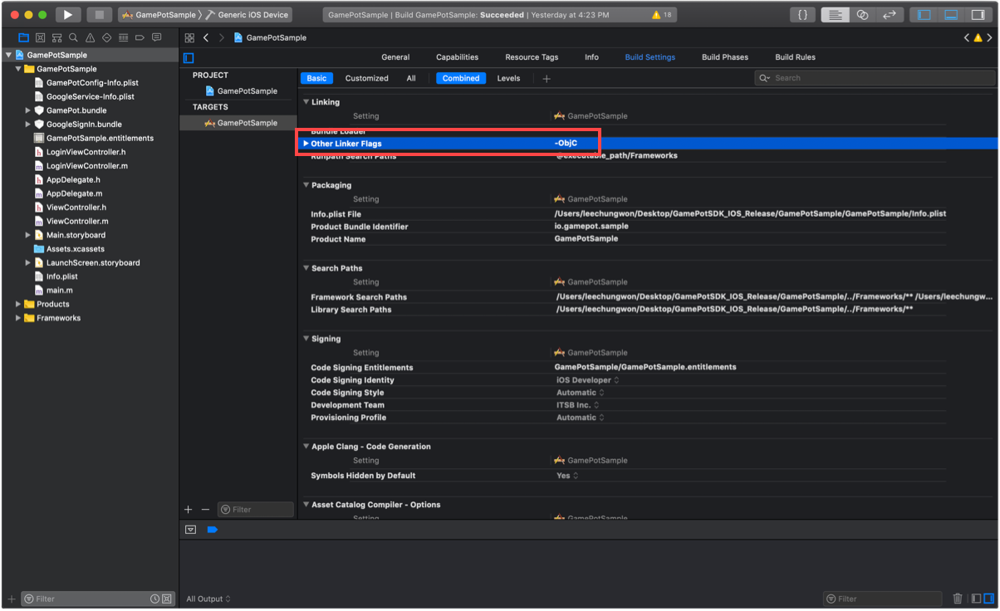
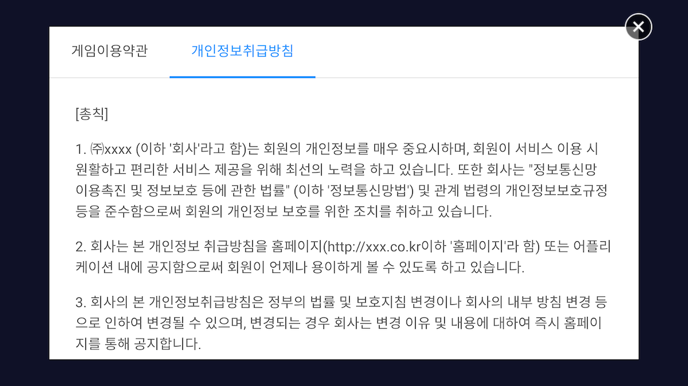

---
search:
  keyword: ['gamepot']
---

## 1. 入门

#### Step 1. 配置开发环境

为了开发 IOS APP 首先需要安装开发工具（XCode）。

在 IOS 使用 GamePot 所需要的系统环境为如下。

[ 系统环境 ]

- 最低：IOS 10.0 或更高
- 开发环境：XCode

#### Step 2. 添加 Freamwork


通过拖动将下载的 IOS SDK 文件添加到 Xcode 项目文件夹目标中。

#### Step 3. 添加 Dependencies

依照使用的功能，所需要的 Dependencies 列表有差异

请参考下列表格添加所需要的 Dependencies

功能别 Dependencies

| Service     | Framework                                                                                                                                                                                                                                                                                                                                                                                                                                                                                                                                                                     | Dependencies                                                                                                                                                                                  | bundle                                                  |
| ----------- | ----------------------------------------------------------------------------------------------------------------------------------------------------------------------------------------------------------------------------------------------------------------------------------------------------------------------------------------------------------------------------------------------------------------------------------------------------------------------------------------------------------------------------------------------------------------------------- | --------------------------------------------------------------------------------------------------------------------------------------------------------------------------------------------- | ------------------------------------------------------- |
| 基本(Base)  | AFNetworking.framework<br />FirebaseAnalytics.framework<br />FirebaseCore.framework<br />FirebaseCoreDiagnostics.framework<br />FirebaseInstanceID.framework<br />FirebaseMessaging.framework<br />FirebaseNanoPB.framework<br />GamePot.framework<br />GoogleToolboxForMac.framework<br />nanopb.framework<br />Protobuf.framework<br />                                                                                                                                                                                                                                     | libz.tbd<br />WebKit.framework<br />UserNotifications.framework<br />                                                                                                                         | GamePot.bundle<br />                                    |
| 登录(Login) | [ Base ]<br />GamePotChannel.framework<br /><br />[ Google Sign In ]<br />GamePotGoogleSignIn.framework<br/>GoogleSignIn.framework<br />GTMOAuth2.framework<br />GTMSessionFetcher.framework<br /><br />[ Facebook ]<br />Bolts.framework<br/>FBSDKCoreKit.framework<br />FBSDKLoginKit.framework<br />GamePotFacebook.framework<br /><br />[ LINE ]<br/>GamePotLine.framework<br/>LineSDK.framework<br/>LineSDKObjC.framework <br/><br/>[ Twitter ]<br/> GamePotTwitter.framework<br/>TwitterKit.framework (Dynamic Library)<br/>TwitterCore.framework(Dynamic Library)<br/> | [ Google Sign In ]<br />SafariServices.framework<br />[ Facebook ]<br />SafariServices.framework<br />[ LINE ]<br/>SafariServices.framework<br/>[ Twitter ]<br/>SafariServices.framework<br/> | [ Google Sign In ]<br />GoogleSignIn.bundle<br /><br /> |
| GameCenter  | GamePotGameCenter.framework                                                                                                                                                                                                                                                                                                                                                                                                                                                                                                                                                   |                                                                                                                                                                                               |                                                         |


#### Step 4. 添加 Bundle Resource

根据所要使用的功能，需要添加 Bundle Resource 文件。

参考功能别 Dependencies 表格，添加 Bundle Resource 文件。



#### Step 5. 添加 InfoPlist


基本上 GamePot SDK 使用 Google Firebase。所以需要在项目添加设置 Google Firebase 后生成的 GoogleService-Info.plist。

也需要添加包含着 GamePot SDK 的默认设置值的 GamePotConfig-Info.plist 文件。

**GamePotConfig-Info.plist 设置**



```xml
gamepot_project_id : GAMEPOT Project Id
gamepot_elsa_projectid : GAMEPOT Log Project Id (optional)
gamepot_api_url : GAMEPOT API URL
```

#### Step 6. 添加 Build 选项

Build Settings -> Linking -> Other Linker Flags 部分 添加-ObjC 选项。



#### Step 7. Info.plist 修复

在 Targets >> Info >> Custom iOS Target Properties 中，请添加获取以下用户权限的选项。

GamePot 客户中心内的文件上传功能使用此用户权限。

```
NSCameraUsageDescription
NSPhotoLibraryUsageDescription
```

#### Step 8. Google Sign In 登录环境设置

参考功能别 Dependencies 表格中的 Login >> Google Sign In。添加 Framework 和 Dependencies。

复制 GoogleService-Info.plist 文件的 REVERSED_CLIENT_ID 的值之后，在 Info >> URL Types 新加一个项目，然后在 URL Schemes 粘贴相关值。


**GamePotConfig-Info.plist 设置**


```xml
gamepot_google_app_id : GoogleService-Info.plist 文件的 CLIENT_ID 值
gamepot_google_url_schemes : GoogleService-Info.plist 文件的 REVERSED_CLIENT_ID 值
```

#### Step 9. Facebook 登录环境设置

参考功能别 Dependencies 表格的 Login >> Facebook。添加 Framework 和 Dependencies。

将 Facebook App ID 添加到 Info >> URL Types 中，添加格式为 fb+Facebook App ID。


Info >> iOS Target Property 的 LSApplicationQueriesSchemes 中添加以下项目。

```xml
fbapi
fb-messenger-share-api
fbauth2
fbshareextension
```


**GamePotConfig-Info.plist 设置**


```xml
gamepot_facebook_app_id : Facebook App ID
gamepot_facebook_display_name : Facebook display name
```

#### Step 10. LINE 登录环境设置

**GamePotConfig-Info.plist 设置**

```xml
gamepot_line_channelid : Line Channel ID
gamepot_line_url_schemes : Line URL Scheme (line3rdp.{프로젝트 번들 ID})
```

#### Step 11. Twitter 登录环境设置

**GamePotConfig-Info.plist 设置**

```xml
gamepot_twitter_consumerkey : Twitter Consumer Key
gamepot_twitter_consumersecret :  Twitter Consumer Secret
```

#### Step12. Naver 登录环境设置

**GamePotConfig-Info.plist 设置**

```
gamepot_naver_clientid : Naver Client Id
gamepot_naver_secretid : Naver Secret Id
gamepot_naver_urlscheme : Naver Url Scheme
```

**Info >> iOS Target Property 的 LSApplicationQueriesSchemes 中添加以下项目。**

- naversearchapp
- naversearchthirdlogin
- navercafe

将您在 gamepot_naver_urlscheme 中输入的值添加到**Info > URL Types**

## 2. 初始化

AppDelegate 文件里加上以下内容。

```objective-c
#import <GamePot/GamePot.h>

- (BOOL)application:(UIApplication *)application didFinishLaunchingWithOptions:(NSDictionary *)launchOptions {
    ...
    // GamePot SDK Initialize
    [[GamePot getInstance] setup];

    // Push Permission
    if(SYSTEM_VERSION_GRATERTHAN_OR_EQUALTO(@"10.0"))
    {
        UNUserNotificationCenter *center = [UNUserNotificationCenter currentNotificationCenter];
        center.delegate = self;
        [center requestAuthorizationWithOptions:(UNAuthorizationOptionSound | UNAuthorizationOptionAlert | UNAuthorizationOptionBadge) completionHandler:^(BOOL granted, NSError * _Nullable error){
            if(!error){
                dispatch_async(dispatch_get_main_queue(), ^{
                    [[UIApplication sharedApplication] registerForRemoteNotifications];
                });
            }
        }];
    }
    else
    {
        // Code for old versions
        UIUserNotificationType allNotificationTypes = (UIUserNotificationTypeSound | UIUserNotificationTypeAlert | UIUserNotificationTypeBadge);
        UIUserNotificationSettings *settings = [UIUserNotificationSettings settingsForTypes:allNotificationTypes categories:nil];
        [application registerUserNotificationSettings:settings];
        [application registerForRemoteNotifications];
    }
    ...
}

 // Push
- (void)application:(UIApplication *)application didRegisterForRemoteNotificationsWithDeviceToken:(NSData *)deviceToken
{
    ...
    [[GamePot getInstance] handleRemoteNotificationsWithDeviceToken:deviceToken];
    ...
}

- (void)applicationWillEnterForeground:(UIApplication *)application {
    [[GamePotChat getInstance] start];
}

- (void)applicationDidEnterBackground:(UIApplication *)application {
    [[GamePotChat getInstance] stop];
}
```

## 3. 登录/退出/注销

Google/Facebook/Naver 等各种登录 SDK 可以集成使用。

#### Step 1. 设置

```objective-c
// AppDelegate.m
#import <GamePotChannel/GamePotChannel.h>

// 使用Google Login的时候
#import <GamePotGoogleSignIn/GamePotGoogleSignIn.h>

// 使用Facebook Login的时候
#import <GamePotFacebook/GamePotFacebook.h>

// 使用Line Login的时候
#import <GamePotLine/GamePotLine.h>

// 使用Twitter Login的时候
#import <GamePotTwitter/GamePotTwitter.h>

// 使用Naver Login的时候
#import <GamePotNaver/GamePotNaver.h>

- (BOOL)application:(UIApplication *)application didFinishLaunchingWithOptions:(NSDictionary *)launchOptions {
    ...
    // GamePotSDK频道初始化，必须要对于所使用的频道别使用 addChannel才可以。
    // Guest方式默认包含
    // Google Login初始化
    GamePotChannelInterface* google     = [[GamePotGoogleSignIn alloc] init];
    [[GamePotChannelManager getInstance] addChannelWithType:GOOGLE interface:google];

    // Facebook登录初始化
    GamePotChannelInterface* facebook   = [[GamePotFacebook alloc] init];
    [[GamePotChannelManager getInstance] addChannelWithType:FACEBOOK interface:facebook];

    // Line 登录初始化
    GamePotChannelInterface* line = [[GamePotLine alloc] init];
    [[GamePotChannel getInstance] addChannelWithType:LINE interface:line];

    // Twitter 登录初始化
    GamePotChannelInterface* twitter = [[GamePotTwitter alloc] init];
    [[GamePotChannel getInstance] addChannelWithType:TWITTER interface:twitter];

    // Naver 登录初始化
    GamePotChannelInterface* naver = [[GamePotNaver alloc] init];
    [[GamePotChannel getInstance] addChannelWithType:NAVER interface:naver];


    // 处理登录所需要。
    [[GamePotChannel getInstance] application:application didFinishLaunchingWithOptions:launchOptions];

    ...
}

- (BOOL)application:(UIApplication *)app openURL:(NSURL *)url options:(NSDictionary<UIApplicationOpenURLOptionsKey,id> *)options
{
    // 处理登录所需要。
    BOOL nChannelResult = [[GamePotChannel getInstance] application:app openURL:url options:options];
    return nChannelResult;
}
```

#### Step 2. 登录

点击登录按钮的时候调用

```objective-c
#import <GamePotChannel/GamePotChannel.h>
// 定义登录类型
// GamePotChannelType.GOOGLE
// GamePotChannelType.FACEBOOK
// GamePotChannelType.GUEST
// GamePotChannelType.LINE
// GamePotChannelType.TWITTER
// GamePotChannelType.NAVER

// 点击Google登录按钮的时候调用
[[GamePotChannel getInstance] Login:GOOGLE viewController:self success:^(GamePotUserInfo* userInfo) {
    // 登录完成
} cancel:^{
    // 登录过程中用户取消登录
} fail:^(NSError *error) {
    // 登录过程中出现错误
    // TODO : 使用游戏内弹窗提示失败原因。
    // TODO : 提示请使用[error localizedDescription]

}];

```

#### Step 3. 自动登录

GamePot 支持自动登录

```objective-c
#import <GamePotChannel/GamePotChannel.h>

// 获取最终登录过的信息，根据此内容尝试自动登录
// lastLoginType : 可以获取最后登录的值
GamePotChannelType type = [[GamePotChannel getInstance] lastLoginType];

if(type != NONE)
{
    // 使用最后登录的登录类型登录的方式
    // 处理自动登录时，请调用为如下。
    [[GamePotChannel getInstance] Login:type viewController:self success:^(GamePotUserInfo* userInfo) {

    } cancel:^{

    } fail:^(NSError *error) {
        // TODO : 使用游戏内弹窗提示失败原因
        // TODO : 提示内容请使用[error localizedDescription]

    }];
}
else
{
    // 没有最后登录的信息。自动移动至有登录按钮的界面。
}
```

#### Step 4. 退出

退出目前所登录的账号.

```objective-c
#import <GamePotChannel/GamePotChannel.h>

[[GamePotChannel getInstance] LogoutWithSuccess:^{
	//退出完成之后移动至最初界面
} fail:^(NSError *error) {
    // 退出失败
    // TODO : 请使用游戏内提示窗提示失败原因。
    // TODO : 提示内容请使用[error localizedDescription]
}];
```

#### Step 5. 注销

注销目前登录的账号

```objective-c
#import <GamePotChannel/GamePotChannel.h>

[[GamePotChannel getInstance] DeleteMemberWithSuccess:^{
	// 账号注销成功，移动至登录界面
} fail:^(NSError *error) {
    // 账号注销失败
    // TODO : 请使用游戏内提示窗提示失败原因。
    // TODO : 提示内容请使用[error localizedDescription]
}];

```

## 4. 账号绑定

一个游戏账号可以绑定/解除多个社交账户（Google/FaceBook 等）的功能。（至少可以绑定一个社交账户）

游戏内需要开发相关绑定界面。在游戏界面用户点击绑定的时候调用以下代码。

#### Step 1. 账号绑定

可以使用 Google / Facebook 等账号绑定账号。

```objective-c
#import <GamePotChannel/GamePotChannel.h>

// 定义类型
// GamePotChannelType.GOOGLE
// GamePotChannelType.FACEBOOK
// GamePotChannelType.LINE
// GamePotChannelType.TWITTER
// GamePotChannelType.NAVER

[[GamePotChannel getInstance] CreateLinking:GOOGLE viewController:self success:^(GamePotUserInfo *userInfo) {
	// TODO : 绑定完成。使用游戏内的弹窗提示绑定完成结果。 (ex. 계정 연동에 성공했습니다.)
} cancel:^{
	// TODO : 用户取消
} fail:^(NSError *error) {
    // TODO : 绑定失败。使用游戏内的弹窗提示绑定失败原因。
    // TODO : 提示内容请使用[error localizedDescription]。
}];

```

#### Step 2. 被绑定的列表

通过此 API 可以确认绑定状态

```objective-c
#import <GamePotChannel/GamePotChannel.h>

// 定义类型
// GamePotChannelType.GOOGLE
// GamePotChannelType.FACEBOOK
// GamePotChannelType.LINE
// GamePotChannelType.TWITTER
// GamePotChannelType.NAVER

// 返回定义类型的绑定结果
BOOL isGoogleLinked = [[GamePotChannel getInstance] isLinked:GOOGLE];

// 对绑定的类型以JsonString返回。
NSString* linkedList = [[GamePotChannel getInstance] getLinkedListJsonString];
```

#### Step 3. 解除绑定

解除目前已绑定的账号

```objective-c
#import <GamePotChannel/GamePotChannel.h>

[[GamePotChannel getInstance] DeleteLinking:GOOGLE success:^{
     // TODO : 解绑完成。使用游戏内弹窗提示解绑完成结果。 (ex. 계정 연동을 해제했습니다.)
} fail:^(NSError *error) {
     // TODO : 解绑失败。使用游戏内弹窗提示解绑失败原因。
     // TODO : 提示请使用[error localizedDescription]
}];
```

## 5. 支付

#### Step 1. 设置

支付的结果值以 Delegate 格式使用。所以请把 Delegate 添加为如下。

```objective-c
#import <GamePot/GamePot.h>

@interface ViewController () <GamePotPurchaseDelegate>
@end
@implementation ViewController

- (void)viewDidLoad
{
    ...
    [[GamePot getInstance] setPurchaseDelegate:self];
    ...
}

- (void)GamePotPurchaseSuccess:(GamePotPurchaseInfo *)_info
{
    // 支付成功

    //如果您使用广告作为代码在广告平台上投放付款活动，请务必！请插入它。
    [[GamePotAd getInstance] tracking:BILLING obj:_info];
}

- (void)GamePotPurchaseFail:(NSError *)_error
{
    // 支付错误
    // TODO : 使用游戏内弹窗提示失败原因。
    // TODO : 提示请使用[error localizedDescription]
}

- (void)GamePotPurchaseCancel
{
    // 尝试支付中取消
    // 결제가 취소 되었습니다. 支付取消的韩文提示请使用游戏内弹窗提示给用户。
}
@end
```

#### Step 2. 尝试支付

```objective-c
#import <GamePot/GamePot.h>

// productid使用各个渠道的商品ID
[[GamePot getInstance] purchase:productid];
```

## 6. 其他 API

### Coupon

```objective-c
#import <GamePot/GamePot.h>

[[GamePot getInstance] coupon:/*用户所输入的兑换码*/ handler:^(BOOL _success, NSError *_error) {
    if(_success)
    {
        // TODO : 通过message返回兑换码使用结果。请使用游戏内弹窗提示相关内容。
    }
    else
    {
        // TODO : _error返回兑换码使用失败的原因。
        // [_error localizedDescription]的内容请用游戏内弹窗提示给用户。
    }
}];
```

### Push

```objective-c
#import <GamePot/GamePot.h>

// 开关推送 On / Off
[[GamePot getInstance] setPushEnable:YES success:^{

} fail:^(NSError *error) {

}];

// 开关夜间推送 On / Off
[[GamePot getInstance] setNightPushEnable:YES success:^{

} fail:^(NSError *error) {

}];

// 开关广告推送 On / Off
[[GamePot getInstance] setAdPushEnable:YES success:^{

} fail:^(NSError *error) {

}];

// 推送 / 夜间推送 / 广告推送 一并设置
// 如果游戏在登录前收到推/夜推/广告推送，则必须在登录后使用以下代码进行调用。
[[GamePot getInstance] setPushStatus:YES night:YES ad:YES success:^{
    <#code#>
} fail:^(NSError *error) {
    <#code#>
}];
```

### 公告

DashBoard - 在公告栏所上传图像显示的功能。

#### 调用

```java
[[GamePot getInstance] showNotice:/*viewController*/ setSchemeHandler:^(NSString *scheme) {
	NSLog(@"scheme = %@", scheme);
}];
```

### 客户中心

DashBoard - 连接客户中心的功能。用户与运营商之间的沟通窗口。

#### 调用

```java
[[GamePot getInstance] showHelpWebView:(UIViewController *)];
```

### 本地推送(Local Push notification)

不通过推送服务器，直接在设备自行推送的功能。

#### 调用

#### 推送注册

在指定时间显示本地推送的方法为如下。

> 返回所传达的 pushid 值由开发公司来管理。

```java
 NSDateFormatter* formatter = [[NSDateFormatter alloc] init];
 [formatter setDateFormat:@"yyyy-MM-dd HH:mm:ss"];

 NSString* strDate = [formatter stringFromDate:[[NSDate date] dateByAddingTimeInterval:30]];

 int pushId  = [[GamePot getInstance] sendLocalPush:@"Title" setMessage:@"Message" setDateString:strDate];
```

#### 取消注册推送

可以根据注册推送时所获得的 pushid 来取消现有的推送。

```java
[[GamePot getInstance] cancelLocalPush:(int)pushId];
```

### 维护，强制更行

需要维护或者强制更新功能的时候， DashBoard - 运营中操作激活功能就可以使用。

#### 调用

在现有的下面 API 里可以使用。

#### 1. login API

在现有 login API 里，把 listener 更改为`GamePotAppStatusChannelListener`。

```objective-c
[[GamePotChannel getInstance] Login:GAMECENTER viewController:self
    success:^(GamePotUserInfo* userInfo) {
    		 // 登录成功。依照游戏逻辑处理。
    } cancel:^{
    		// 用户取消登录。
    } fail:^(NSError *error) {
		    // 登录失败。请使用[error localizedDescription]来显示错误信息。
    } update:^(GamePotAppStatus *appStatus) {
        // TODO : 需要强制更新的时候。 调用下面API就可以弹出SDK本身的弹出窗口。
        // TODO : 如希望Customizing的时候，请不要调用下面API并对其进行Customizing就可以。
        [[GamePot getInstance] showAppStatusPopup:self setAppStatus:appStatus
         setCloseHandler:^{
             // TODO : 如调用showAppStatusPopup API，会在结束应用程序的情况下被调用。
             // TODO : 处理关闭过程。
        } setNextHandler：^（NSObject * resultPayload）{
             // TODO：“仪表板更新设置”中的“推荐”设置显示“下一步”按钮。
             //当用户选择它时，将调用此按钮。
             //使用TODO：resultPayload信息处理与登录完成时相同的信息。
             // GamePotUserInfo * userInfo =（GamePotUserInfo *）resultPayload;

        }];
    } maintenance:^(GamePotAppStatus *appStatus) {
  	    // TODO : 如在维护中。调用下面API就可以弹出SDK本身的弹出窗口。
        // TODO : 如希望Customizing的时候，请不要调用下面API并对其进行Customizing就可以。
        [[GamePot getInstance] showAppStatusPopup:self setAppStatus:appStatus
         setCloseHandler:^{
						 // TODO : 如调用showAppStatusPopup API，会在结束应用程序的情况下被调用。
             // TODO : 处理关闭过程。
        }];
    }];
```

### 接受条款

我们提供用户界面，以便轻松获取“使用条款”和“收集和使用个人信息指南”。

`BLUE`主题和`GREEN`主题，每个区域都有自定义。

- `BLUE`主题的例子
- `GREEN`主题的例子

#### 征集协议

> 请同意协议弹出窗口的条款由开发人员处理。
>
> 可以在仪表板中应用和修改“查看”按钮的内容。

```objective-c
// BLUE主题 [[GamePotAgreeOption alloc] init:BLUE];
// GREEN主题 [[GamePotAgreeOption alloc] init:GREEN];
GamePotAgreeOption* option = [[GamePotAgreeOption alloc] init:BLUE];
[[GamePot getInstance] showAgreeView:self option:option handler:^(GamePotAgreeInfo *result) {
   // [result agree] : 如果所有必需条件都为真，则为真
   // [result agreeNight] : 如果检查晚间广告接受，则为真; 否则是假的
   // 登录后，通过[[GamePot getInstance] setNightPushEnable]; api传递agreeNight值。
}];
```

#### 定制

在不使用主题的情况下更改游戏的颜色。

在调用协议之前，您可以在“GamePotAgreeOption”中为每个区域指定颜色。

```objective-c
 GamePotAgreeOption* option = [[GamePotAgreeOption alloc] init:GREEN];

[option setHeaderBackGradient:@[@0xFF00050B,@0xFF0F1B21]];
[option setHeaderTitleColor:0xFF042941];
[option setContentBackGradient:@[@0xFF112432,@0xFF112432]];
[option setContentIconColor:0xFF042941];
[option setContentCheckColor:0xFF91adb5];
[option setContentTitleColor:0xFF98b3c6];
[option setContentShowColor:0xFF98b3c6];
[option setFooterBackGradient:@[@0xFF112432,@0xFF112432]];
[option setFooterButtonGradient:@[@0xFF1E3A57,@0xFF57B2E2]];
[option setFooterButtonOutlineColor:0xFF0b171a];
[option setFooterTitleColor:0xFFFFFFD5];

// 更改文字
[option setAllMessage:@"모두 동의"];
[option setTermMessage:@"필수) 이용약관"];
[option setPrivacyMessage:@"필수) 개인정보 취급 방침"];
[option setNightPushMessage:@"선택) 약간 푸쉬 수신 동의"];
[option setFooterTitle:@"게임 시작하기"];

// 不使用时设为@“”
[option setHeaderTitle:@"약관 동의"];

// 夜间广告接受按钮曝光
[option setShowNightPush:YES];
```

每个变量都应用于下面的区域。

> contentIconDrawable 中的圖像不會向 IOS 公開。


### 服务条款

调用使用条款 UI。

> 儀表板 - 客戶支持 - 首先在條款和條件部分輸入您的內容。

```java
#import <GamePot/GamePot.h>

[[GamePot getInstance] showTerms:/*ViewController*/];
```


### 隐私声明

调用隐私策略 UI。

> 儀表板 - 客戶支持 - 首先輸入您的隱私策略設置。

```java
#import <GamePot/GamePot.h>

[[GamePot getInstance] showPrivacy:/*ViewController*/];
```



## 7. 下载

您可以从 GAMEPOT 仪表板> SDK 下载菜单下载它。
